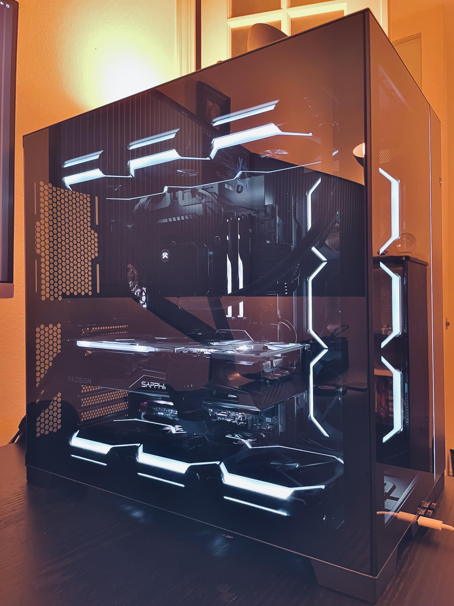
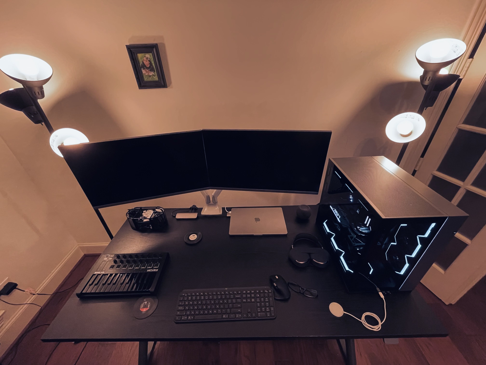

## Hardware

- CPU - 13900KS
- MB - ASRock Z790 Taichi
- GPU - Sapphire RX 6900 XT Nitro+ SE
- HD - WD SN850X
- OTHER - https://pcpartpicker.com/user/computercameron/saved/#view=t64xgs

## Guides / Reference

- luchina-gabriel/BASE-EFI-INTEL-DESKTOP-13THGEN-RAPTOR-LAKE
- https://www.tonymacx86.com/threads/asrock-z690-steel-legend-13900kf-12900k-6600xt.317456/
- https://www.reddit.com/r/hackintosh/comments/sp1zgv/opencore_alder_lake_12thgen_intel_hackintosh/
- https://dortania.github.io/OpenCore-Install-Guide/
- https://dortania.github.io/OpenCore-Post-Install/

## Process

- Started with this: “luchina-gabriel/BASE-EFI-INTEL-DESKTOP-13THGEN-RAPTOR-LAKE”
  - Used this because I couldn’t find raptor lake specific Opencore documentation
- Added `agdpmod=pikera` boot arg for RX6900 XT
- Generated SMBIOS `MacPro7,1`
- Built APCI using SSDTTime
  - `SSDT-AWAK.aml`
  - `SDDT-EC-USBX-DESKTOP.aml`
  - `SSDT-PLUG-ALT.aml`
  - `SSDT-RHUB.aml`
- Enabled `SetupVirtualMap` in Booter Quirks
- Only these kexts used at this point
  - `Lilu.kext`
  - `SMCProcessor.kext`
  - `SMCSuperIO.kext`
  - `VirtualSMC.kext`
  - `WhateverGreen.kext`
- At this point it posts and I am able to proceed with a successful installation
- 2.5G Ethernet Working with `LucyRTL8125Ethernet.kext`
- USB Mapping with `USBMap`
- Bluetooth working with `BlueToolFixup.kext` `BrcmFirmwareData.kext` & `BrcmPatchRAM3.kext`
  - Using SonnetTech MacOS compatible Long-Range USB Bluetooth 4.0 Micro Adapter
- Radeon GPU with `RadeonSensor.kext` & `SMCRadeonGPU.kext`
- Stop Memory Module warning with `RestrictEvents.kext`
- CPU to boost correctly with 
  - `CPUTopologyRebuild.kext` + `-ctrsmt` boot arg
  - Enabled `AppleXcpmForceBoost` in Kernel Quirks
  - `CPUFriend.kext`
- Some CPU performance tuning
  - E core clocks from 4.3 to 4.5
  - Offset Undervolt in BIOS - VF Point Offset from 5.1 upward set to -100mv 
    - When CPU is under full load, this prevents hit TJ max and lowers the overall power draw
- CPU Name changed to “13900KS” with https://github.com/corpnewt/CPU-Name
- Tried to get i219 ethernet working for 3 days and failed
- Checked if iServices were working and it seems the default SMBIOS settings were fine
- Fixed sleep/wake issues  
  - Fixed wake not activating dGPU https://dortania.github.io/OpenCore-Post-Install/universal/sleep.html
    - “Special note for 4k Displays with AMD dGPUs”
  - Fixed instant wake with GPRW patch https://dortania.github.io/OpenCore-Post-Install/usb/misc/instant-wake.html
- FileVault settings https://dortania.github.io/OpenCore-Post-Install/universal/security/filevault.html
- AppleVTD - enable vt-d in bios and disable `DisableIoMapper`
  - For whatever reason, I didn’t have to do anything else (DMAR tables etc) here and the system posts and has AppleVTD
- Tested that audio was working
  - tested embedded (front and back panel) audio working with `AppleALC.kext`. No layout-id needed as its usb audio interface
  - tested Scarlett Focusrite Solo audio working
- Tried to get Thunderbolt 4 support and it didn’t seem to work
  - The Maple Ridge controllers are recognized in Hackintool and I can use the ports as USB3.2 but nothing thunderbolt related seems to work
- Verified DRM was working, didn’t need to do anything. It works
- Updated to latest OpenCore

## Working

- Graphics
- Audio
- Bluetooth
- 2.5G Ethernet Network
- iServices
- Sleep/Wake
- Power Management
- FileVault
- Virtualization
- Overall Performance

## Not Working / Todo

- I219 Ethernet - Tried multiple versions of IntelMausi/Ethernet kext, toggling vt-d, spoofing device id, switching cables and nothing worked. 
  - It’s recognized and the kext loads but device properties doesn’t enumerate it.
- WiFI - This worked with itlwm/Heliport but I didn’t care for the User experience. Will probably replace with a BCM94360 chip
- Airdrop - Pretty sure this will work once I install a BCM94360 chip 
- Thunderbolt - BIOS settings are correct & Maple Ridge controller seems to be recognized but there isn’t any indication that Thunderbolt is working.
  - maybe it has something to do with my USBMap?
  - maybe I need to actually test with verified thunderbolt devices
- GPU to boost correctly in certain workloads (OpenCL & Vulkan) - There seems to be some issue the the default firmware where power saving prevents clock speed from ramping up correctly - this happens in both windows and MacOS - may need custom bios
- CPU performance tweaking still needs work
  - Current undervolt is not stable in certain synthetic benchmarks
  - Single core scores are not always what they could be, will probably fix by enabling Thermal Velocity Boost so the single core boost is higher at lower temps.
  

## BenchMarks

### CineBench 

- Multi: 39K @ 266w

### Geekbench:

- Single: 2925 - https://browser.geekbench.com/v6/cpu/386811
- Multi: 19649 - https://browser.geekbench.com/v6/cpu/386811
- Metal: 231720 - https://browser.geekbench.com/v6/compute/140437 

### Diskmark:

- SEQ1M QD8: Read 6954.13 - Write 6376.51
- SE01M QD1: Read 4603.09 - Write 4741.57
- RNDAK QD64: Read 2396.79 - Write 556.44
- RNDAK QD1: Read 71.58 - Write 760.23

### Blackmagic Disk Speed Test:
- WRITE: 5728 Mbs
- READ: 5593 Mbs

